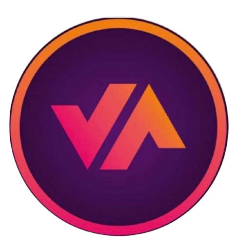

<div align="center">
  
  
  # Vaapty Passo Fundo - Landing Page 🚗💨

  **Acelere a venda do seu veículo de forma 100% segura, rápida e sem burocracia.**
  
  <p align="center">
    <a href="#-sobre-o-projeto">Sobre</a> •
    <a href="#-principais-recursos">Recursos</a> •
    <a href="#-tecnologias-utilizadas">Tecnologias</a> •
    <a href="#-como-executar">Como Executar</a> •
    <a href="#-estrutura-do-projeto">Estrutura</a>
  </p>
</div>

---

## 📖 Sobre o Projeto

Esta é a **Landing Page Oficial** da **Vaapty Passo Fundo**, a maior rede de franquias de compra e venda de carros do Brasil. O projeto foi desenhado com foco em **alta conversão, performance e design premium**, oferecendo uma experiência de usuário (UX) excepcional através de um tema "Dark/Cosmic" com gradientes vibrantes (Rosa e Laranja).

O objetivo principal da página é captar leads interessados em vender seus veículos, destacando diferenciais como:
- Pagamento no formato PIX na hora.
- Negócio resolvido em até 40 minutos.
- Processo 100% seguro (Anti-Golpe).
- Avaliação transparente e justa.

## ✨ Principais Recursos

- 🎥 **Hero Section Dinâmica:** Vídeo de fundo com chamadas de alto impacto e tipografia moderna.
- ♾️ **Carrossel de Marcas:** Rolagem infinita com as principais marcas (Toyota, BMW, Jeep, etc.) criando autoridade.
- ⚖️ **Bloco de Comparação:** Apresentação visual das dores de "Vender Sozinho" x "Vender com a Vaapty".
- 🛡️ **Seção de Segurança (Anti-Golpe):** Reforço de confiança com layout limpo e ícones assertivos.
- 🔔 **Prova Social (Social Proof):** Pop-ups em tempo real no canto da tela informando simulações de vendas recentes, gerando gatilhos de urgência e prova social.
- 💬 **Formulário de Leads e WhatsApp:** Botões "Floating" e CTAs espalhados para contato imediato via WhatsApp.
- 📸 **Galeria do Instagram:** Layout estilo grid de rede social com fotos da loja e equipe.
- 📍 **Mapa e Localização:** Informações claras e diretas de onde encontrar a loja física em Passo Fundo.
- 📱 **100% Responsivo:** Otimizado perfeitamente para Desktop, Tablet e Mobile.

## 🛠 Tecnologias Utilizadas

O projeto foi construído utilizando as ferramentas e frameworks mais modernos do ecossistema front-end:

- **[React](https://reactjs.org/)** (v18)
- **[Vite](https://vitejs.dev/)** - Ferramenta de build extremamente rápida.
- **[TypeScript](https://www.typescriptlang.org/)** - Tipagem estática para maior segurança.
- **[Tailwind CSS](https://tailwindcss.com/)** - Estilização baseada em utilitários para um design customizado e fluido.
- **[Motion (Framer Motion)](https://motion.dev/)** - Animações de entrada, scroll e interações de estado.
- **[Lucide React](https://lucide.dev/)** - Ícones leves e consistentes.

## 🚀 Como Executar

Siga os passos abaixo para rodar o projeto localmente:

### 1. Pré-requisitos
Certifique-se de ter o **Node.js** instalado na sua máquina (versão 18+ recomendada).

### 2. Clonar o repositório
```bash
git clone https://github.com/seu-usuario/vaapty-passo-fundo.git
cd vaapty-passo-fundo
```

### 3. Instalar as dependências
```bash
npm install
# ou 
yarn install
```

### 4. Rodar o servidor de desenvolvimento
```bash
npm run dev
# ou
yarn dev
```
O servidor irá iniciar, normalmente na porta `3000` ou `5173`. Acesse `http://localhost:3000` no seu navegador.

### 5. Fazer o Build para Produção
```bash
npm run build
```
Os arquivos otimizados serão gerados na pasta `dist/`.

## 📂 Estrutura do Projeto

```text
/
├── public/                 # Arquivos estáticos (vídeos, logo, favicon)
│   ├── faca_um_video_tipo_a_garagem_d.mp4
│   └── vaptlogo.png
├── src/
│   ├── components/         # Componentes isolados e reutilizáveis
│   │   ├── BrandsCarousel.tsx
│   │   ├── Comparison.tsx
│   │   ├── Features.tsx
│   │   ├── Footer.tsx
│   │   ├── Gallery.tsx
│   │   ├── Hero.tsx
│   │   ├── LeadForm.tsx
│   │   ├── Location.tsx
│   │   ├── Navbar.tsx
│   │   ├── SecurityBlock.tsx
│   │   ├── SocialProof.tsx
│   │   └── ...
│   ├── App.tsx             # Arquivo principal que reúne todos os componentes
│   ├── main.tsx            # Ponto de entrada do React
│   └── index.css           # Estilos globais e configurações do Tailwind
├── index.html              # Template principal do HTML
├── package.json            # Dependências e scripts do projeto
├── tailwind.config.js      # Configurações do Tailwind CSS (se houver)
├── vite.config.ts          # Configurações do Vite
└── tsconfig.json           # Configurações do TypeScript
```

## 👨‍💻 Desenvolvedor

Este projeto foi construído e otimizado por **Braian Kmdc**.

🔗 **Portfólio:** [https://portfolio-braian-three.vercel.app/](https://portfolio-braian-three.vercel.app/)

---

<p align="center">
  Feito para <span style="color: #df1659; font-weight: bold;">acelerar</span> sua venda. 🚀
</p>
